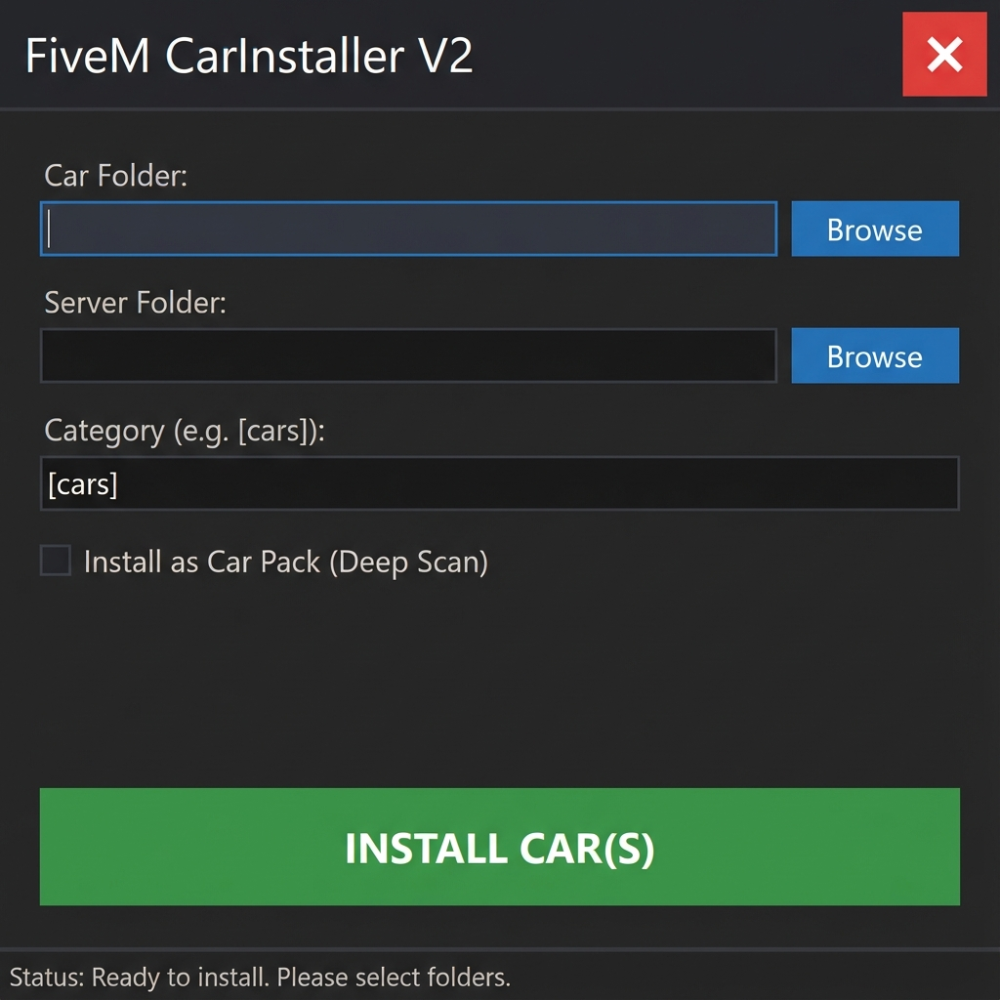

# FiveM CarInstaller V2 🚘

**FiveM CarInstaller V2** is a professional C++ GUI application engineered to streamline the deployment of vehicle modifications for FiveM servers. It automates the complex process of resource management, ensuring a seamless installation experience for both single vehicles and extensive car packs.

## ⚡ Key Features

*   **🤖 Automated Deployment**: Intelligently copies and structures vehicle files into your server's resources directory.
*   **📦 Deep Scan Technology**: Recursively traverses nested directories to detect and install every vehicle within a car pack.
*   **🔧 Smart Auto-Structuring**:
    *   Creates missing `stream` directories.
    *   Organizes `.yft`, `.ytd`, and meta files.
    *   Generates `fxmanifest.lua` if absent.
*   **📂 Categorized Installation**: Supports installation into specific category folders (e.g., `[cars]`, `[emergency]`) for optimal server organization.
*   **⚙️ Config Management**: Automatically appends `ensure <car_name>` to `server.cfg`.
*   **🖥️ Modern Dark Interface**: A sophisticated, borderless dark UI designed for modern Windows environments.
*   **📊 Activity Logging**: Maintains a comprehensive `install_log.txt` for tracking all installation operations.

## 💻 System Requirements

*   **OS**: Windows 10 or Windows 11 (64-bit)
*   **Runtime**: [.NET Framework 4.7.2](https://dotnet.microsoft.com/en-us/download/dotnet-framework/net472) (Usually pre-installed on Windows)
*   **Visual C++**: [Visual C++ 2015-2022 Redistributable (x64)](https://aka.ms/vs/17/release/vc_redist.x64.exe) (Required for C++ apps)

## 🏗️ Build Instructions

**Prerequisites**: Visual Studio 2022 (or newer) with C++/CLI workload.

1.  **Clone**: Clone this repository to your local machine.
2.  **Open**: Load `FiveM CarInstaller V2.slnx` in Visual Studio.
3.  **Configure**: Set build target to **Release** / **x64**.
4.  **Build**: Execute Build Solution (`Ctrl+Shift+B`).

*Output Location*: `x64/Release/FiveM CarInstaller V2.exe`

## 🚀 Usage Guide

1.  **Launch**: Run `FiveM CarInstaller V2.exe`.
2.  **Source Selection**:
    *   **Single Vehicle**: Select the specific vehicle folder.
    *   **Vehicle Pack**: Select the root folder containing multiple vehicles.
3.  **Destination**: Point to your FiveM server's root directory.
4.  **Categorization**: (Optional) Define a category folder (e.g., `[cars]`).
5.  **Pack Mode**: Enable **"Install as Car Pack (Deep Scan)"** for batch installations.
6.  **Execute**: Click **INSTALL CAR(S)** to begin the process.

## 📄 License

Open Source. Distributed under the MIT License.

---
*Developed with C++/CLI & .NET Framework*
